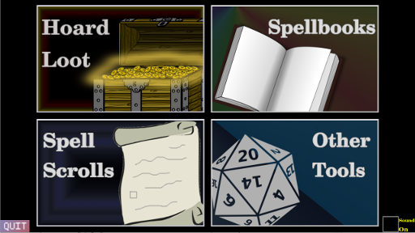

# Plunder D&D Loot

_save hours of game time by letting your cpu lookup things in the book_

## Features of Plunder

1. HOARD LOOT
    * Generate Piles of Treasure 
    * Horde Loot Logic, See 5e DM Guide
    * save to file working
2. SPELLBOOKS
    * Generate Any Size Spellbooks pre-filled with Random spells
    * save to file working
3. SPELL SCROLLS
    * Generate Scrolls of any level pre-rolled into random spell
4. OTHER TOOLS
    * Generate Random Names
        * [based on Kismet's list](http://www.dnd.kismetrose.com/pdfs/KismetsFantasyNames.pdf)

## Build

Use CMake

| Built Using |
| --- |
| [Jetbrains CLion IDE](https://www.jetbrains.com/clion/) - however the toolchain should be able to be set up on any modern IDE| 
| [C++ mingw32 compiler](http://www.mingw.org/) - development toolcahin|
| [CMake build tool](https://cmake.org/) - probably comes with mingw |
| [SDL2 Libaries](https://www.libsdl.org/download-2.0.php) - add to mingw |
