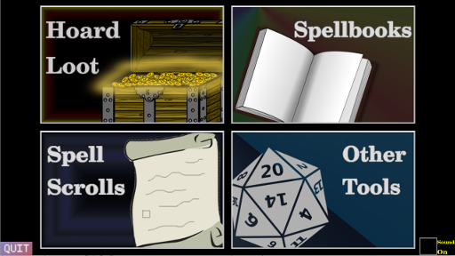

# Plunder

*A D&D loot and planning helper program for Dungeon Masters*

#### get to lootin'



1. ````git clone https://github.com/bytePro17124/Plunder.git```` downloads this program
2. ````cd plunder```` moves to directory
3. ````make dep```` installs all dependencies using apt-get (in general you will need the sdl2 libraries to work with this program)
4. ````make```` builds the program
5. ````./plunder```` runs the program

#### notes and todo

* this program is still a work in progress
	* functional : Hoard Loot, Spell Scrolls
	* being built/not yet functional : Spellbooks, Other Tools
* there are plenty of other ways to get this running but I won't be covering them here
* running within a virtual machine will not use vsync correctly, and some screens may fly by at an alarming rate. This is to be expected in a vm but shouldn't effect core functionality

*please notify me of any issues!*
